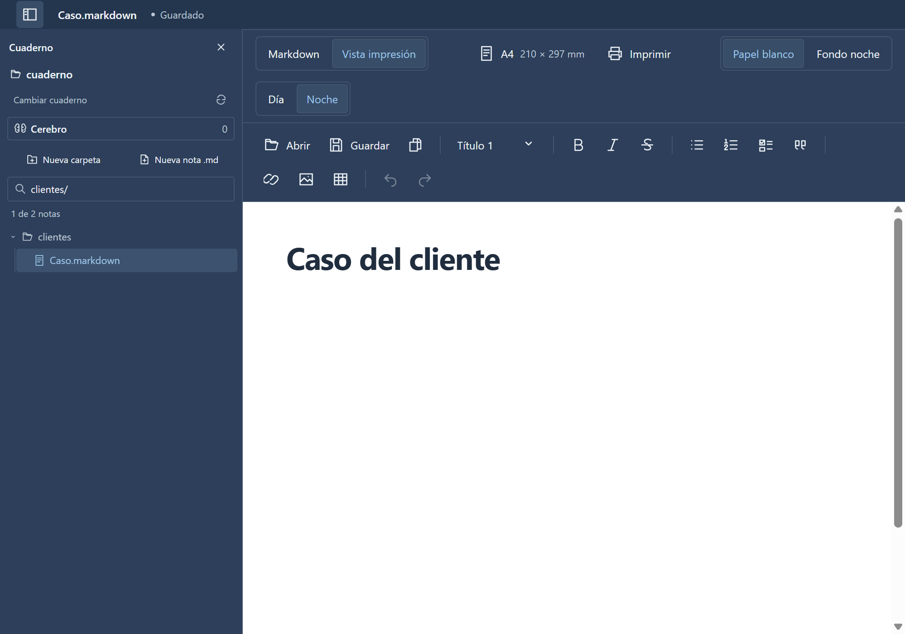
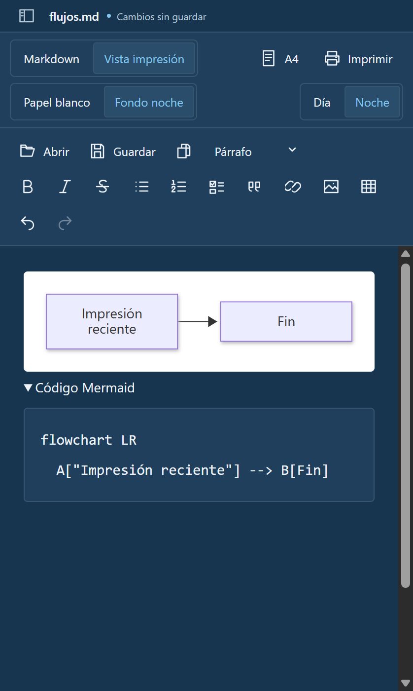
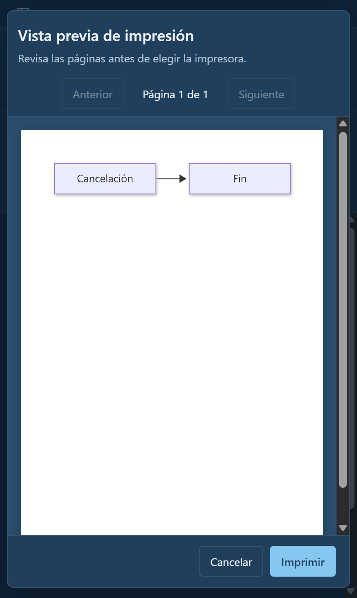

# hiloo

Notas en Markdown para Windows.

hiloo sirve para escribir, ordenar y conectar tus notas. Puedes llevar apuntes de estudio, reuniones o proyectos en cuadernos, y abrir **Cerebro** para ver las conexiones entre tus notas.

Tus notas son archivos `.md` en tu computador. No necesitas una cuenta y puedes abrirlas con otro editor cuando quieras.



## De una nota a un cuaderno

Una carpeta funciona como cuaderno. Desde hiloo puedes crear notas y subcarpetas, buscar por nombre y volver a tus cuadernos recientes.

Para escribir, alterna entre el código Markdown y una vista con formato. Hay títulos, listas de tareas, tablas, imágenes y enlaces, además de temas Día y Noche.

Si una nota se relaciona con otra, enlázalas. **Cerebro** muestra esas conexiones y te deja revisar una nota antes de abrirla. Así puedes recorrer un proyecto sin perder de vista lo que estabas escribiendo.

## Diagramas e impresión

Agrega un flujo Mermaid a una nota y mira el diagrama junto a su código editable. Sirve para explicar pasos, decisiones o cómo se organiza un proceso.

Cuando necesites imprimir, elige el tamaño de papel y revisa las páginas en la vista previa de hiloo. Después abre el diálogo de Windows para elegir la impresora.

| Un flujo dentro de la nota | Vista previa antes de imprimir |
| --- | --- |
|  |  |

## Cómo probarlo

hiloo está en desarrollo para **Windows de 64 bits**. Aún no hay un instalador publicado en este repositorio.

Si tienes Node.js 22.13 o posterior en la rama 22, o Node.js 24+, ejecuta desde la carpeta del proyecto:

```powershell
npm ci
npm run dev
```

El guardado es manual: todavía no hay autoguardado ni historial de versiones.

## Para seguir

- [Cómo usar cuadernos y Cerebro](docs/cuadernos-y-cerebro.md)
- [Flujos Mermaid y formatos admitidos](docs/estilo-markdown.md#flujos-mermaid)
- [Papel, vista previa e impresión](docs/vistas-e-impresion.md)
- [Consultar tus cuadernos desde herramientas de IA](docs/cerebro-sqlite.md)

Para desarrollar o contribuir, revisa la [guía de desarrollo](docs/desarrollo.md) y las [reglas del repositorio](AGENTS.md).

## Licencia

hiloo es software libre bajo la [licencia MIT](LICENSE).
