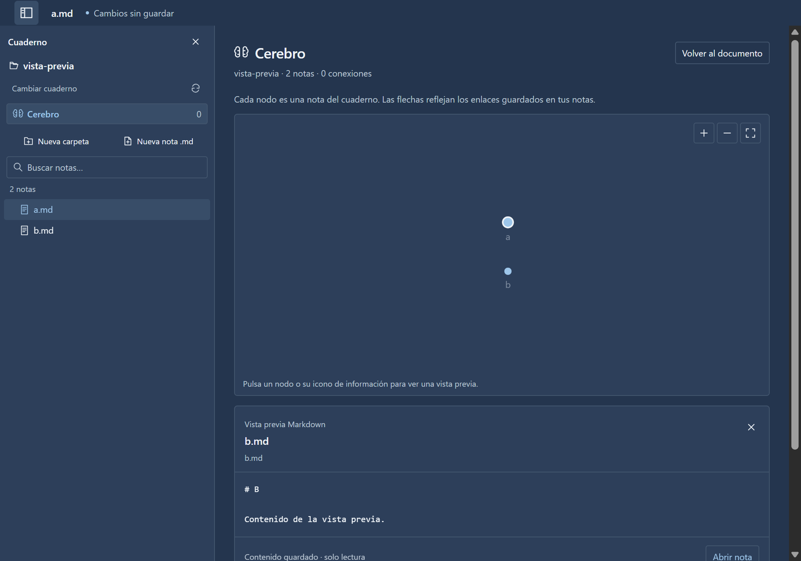
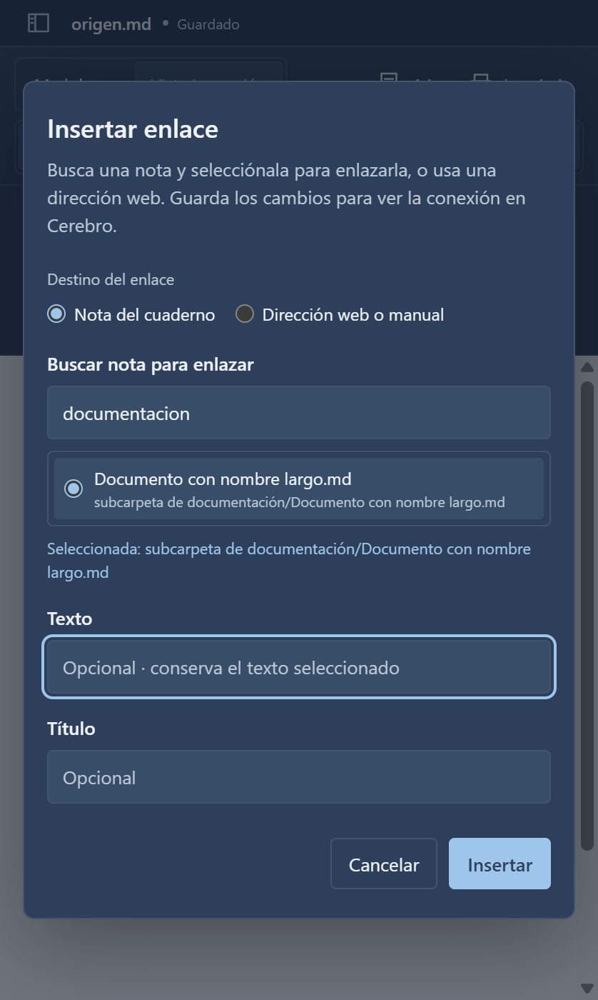

# Auditoría de Cuadernos, Cerebro y enlaces

Fecha: 2026-10-03. Resumen de las verificaciones de esta entrega y de la revisión realizada por un agente independiente de sus autores.

## Resultado

Se verificaron el árbol compacto, la búsqueda recursiva, la creación de carpetas y notas, el aislamiento entre cuadernos, el grafo y su vista previa, y la selección de archivos para insertar enlaces. Los defectos confirmados de foco al navegar, encuadre de 1.000 nodos y recuperación del formulario estrecho se corrigieron y revalidaron. No quedaron defectos importantes confirmados abiertos dentro del alcance revisado.

## Validación

- Compilación TypeScript y empaquetado Windows correctos.
- Suite completa tras añadir creación: **158 aprobadas y 6 omitidas** por fotografía privada opcional no disponible.
- Tras añadir el selector de enlaces: **70/70 aprobadas** en local y empaquetado, ejecutando `tests/link-picker.spec.ts`, `tests/rich-editor.spec.ts`, `tests/workspace.spec.ts` y `tests/workspace-create.spec.ts`.
- Pruebas independientes adicionales: 9 iniciales y 5 de la revisión de árbol/preview; 8 de creación; 5 del selector de enlaces. Estas cifras corresponden a revisiones sucesivas, no a una sola ejecución sobre el paquete final.
- El selector final se comprobó también con respuestas tardías, cancelación, cambio de documento, nombres especiales, conservación de formato, deshacer/rehacer y reapertura desde disco.

Paquete final: `dist/link-picker/win-unpacked/hiloo.exe`. SHA-256 de `resources/app.asar`: `94015DF273E850787A73A9C2DF83A7704F160F16E6C78E99C8AD69C7D37A64CD`.

Los informes detallados y las pruebas adicionales permanecen en `.verification/independent-audit/`, `.verification/creation-audit/` y `.verification/link-picker-audit/`, excluidos de Git. Los tests reproducibles de producto están en `tests/`. `HILOO_TEST_PACKAGED_PATH` permite seleccionar el ejecutable al probar un paquete alternativo.

## Capturas

Capturas del paquete final con datos temporales de prueba:

## Límites

La revisión no certifica instalación NSIS, impresión física, accesibilidad completa con lector de pantalla ni ausencia de toda carrera posible con modificaciones externas simultáneas del sistema de archivos. Los límites de exploración y el uso de contenido guardado están documentados en [Cuadernos y Cerebro](cuadernos-y-cerebro.md). Mermaid sigue siendo una recomendación investigada, sin renderizador integrado.
