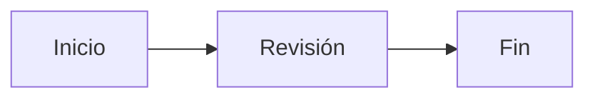

# Presentación y conservación de Markdown — entrega 2

Milkdown con CommonMark, extensiones GFM y ProseMirror convierte Markdown en edición visual. El contenedor público es `.hiloo-document`; las reglas viven en `src/renderer/src/Editor.module.css`. Los archivos guardan contenido y estructura, no las preferencias visuales. La integración del visualizador añade edición de código Markdown y [formato de página e impresión](vistas-e-impresion.md). No hay exportación directa HTML/PDF ni instalación de temas en esta versión.

**Vista impresión** comienza con fondo blanco y texto oscuro; permite elegir Fondo noche independientemente del tema Día/Noche de la interfaz. El contenedor de esa vista sobrescribe las variables de color del documento; los valores base de la tabla siguiente corresponden al tema nocturno fuera de ese contenedor. La salida impresa siempre usa papel blanco y aplica tamaño de papel, márgenes de 15 mm y tipografía de 11 pt mediante reglas `@media print`.

| Variable | Predeterminado | Alcance |
| --- | --- | --- |
| `--hiloo-document-font` | `'Segoe UI', system-ui, sans-serif` | Familia del cuerpo del documento. |
| `--hiloo-document-text` | `#edf3f8` | Color principal del documento. |
| `--hiloo-document-size` | `17px` | Tamaño CSS del texto. |
| `--hiloo-document-line-height` | `1.8` | Interlineado, preferentemente número sin unidad. |
| `--hiloo-document-width` | `860px` | Ancho máximo incluyendo relleno lateral; siempre limitado por la ventana. |

Los títulos usan `--hiloo-ui-font`. Enlaces, cursor y borde de cita usan `--hiloo-accent`; citas y marcadores usan `--hiloo-muted`; código y separadores comparten los colores de interfaz. No existe todavía un juego independiente de variables para todos los elementos. El relleno es 48 px por lado, 24 px bajo 600 px; no está expuesto como variable.

Selectores públicos dentro de `.hiloo-document`: `p`, `h1` a `h6`, `strong`, `em`, `ul`, `ol`, `li`, `li::marker`, `blockquote`, `a`, `code`, `pre`, `pre code` y `hr`. Las clases `ProseMirror-*`, la estructura Milkdown y las clases de CSS Modules son internas.

Ejemplo para modificar el código del tema, sin afectar a los controles:

```css
:root {
  --hiloo-document-font: Georgia, serif;
  --hiloo-document-size: 18px;
  --hiloo-document-line-height: 1.85;
  --hiloo-document-width: 800px;
}
.hiloo-document.hiloo-document blockquote {
  font-style: italic;
}
```

La clase repetida iguala la especificidad del contenedor privado: cargar esa regla después de los estilos del editor. No ocultar nodos, cambiar `contenteditable`, interceptar puntero ni eliminar las indicaciones de selección/cursor. Los ejemplos son cambios de código; no implican un selector de temas disponible.

## Formatos y guardado

- La barra permite párrafos, títulos 1–6, negrita, cursiva, tachado, listas con viñetas/numeradas, tareas, citas, tablas, imágenes, enlaces, deshacer y rehacer. También se conservan código inline, bloques de código sin atributos adicionales, saltos y separadores compatibles. Los enlaces se insertan, editan y quitan desde un diálogo; no navegan al pulsarlos.
- Las tablas usan GFM y conservan la alineación de sus columnas; las tablas anchas tienen desplazamiento horizontal propio. Tab y Mayús+Tab recorren las celdas; Enter al final permite continuar fuera de la tabla. Las tareas conservan su estado marcado o pendiente. Las imágenes conservan origen, texto alternativo y título. Se pueden usar URL HTTP(S) o rutas relativas como `imagenes/foto.png`. Para mostrar imágenes locales el Markdown debe estar guardado: solo se leen archivos PNG, JPEG, GIF, WebP, BMP o AVIF de hasta 10 MiB dentro de su carpeta o subcarpetas. No se cargan rutas absolutas, `file:`, `data:` ni archivos que escapen de esa carpeta mediante `..` o enlaces simbólicos. Los SVG locales no se cargan. Una imagen ausente conserva su referencia para poder corregirla; guardar en otra carpeta vuelve a resolver las rutas desde el nuevo destino, sin copiar imágenes.
- Se aceptan archivos `.md` o `.markdown` UTF-8, con o sin BOM, hasta 2 MiB. No se aceptan enlaces simbólicos. El pegado importa únicamente texto plano; arrastrar contenido al editor está desactivado.
- Sin edición, Guardar deja intactos los bytes originales; Guardar como los copia. Deshacer hasta el estado guardado permite recuperar esa condición. Después de editar se serializa todo el documento: pueden cambiar títulos Setext a `#`, delimitadores `__` a `**`, viñetas, indentación, escapes, líneas vacías y salto final. Se conserva el BOM y se usan CRLF si el original los tenía; archivos con saltos mixtos se normalizan. El formato visual y el texto admitido se preservan, no la ortografía exacta de Markdown.
- HTML, referencias (incluidas imágenes y enlaces por referencia), notas al pie, frontmatter YAML/TOML, atributos de código y protocolos peligrosos se rechazan antes de sustituir el documento actual. Los párrafos que comienzan por `$$` o `:::` se bloquean conservadoramente; esos literales sí se permiten dentro de bloques de código y código inline. Extensiones no reconocidas por CommonMark/GFM pueden considerarse texto literal; no se promete compatibilidad con dialectos arbitrarios ni interpretación de fórmulas inline.
- Antes de habilitar edición visual se compara la estructura analizada del original con su serialización. Si difieren, se bloquea la vista visual; cambiar a Markdown permite revisar y corregir el código conservado. Este control es conservador, no una garantía universal de equivalencia entre dialectos.

Ejemplo compatible para pruebas manuales, sin precargarlo en la aplicación:

```markdown
# Una nota

Texto con **negrita**, *cursiva* y `código`.

- Primer elemento
- Segundo elemento

> Una cita.

[Referencia](https://example.com)
```

## Flujos Mermaid

Los bloques de código con lenguaje `mermaid` muestran un diagrama local en Vista impresión. Se admiten cabeceras `flowchart` o `graph` con dirección `TB`, `TD`, `BT`, `RL` o `LR`; otros tipos conservan su código con un aviso. Por ejemplo:

````markdown

````

El desplegable **Código Mermaid** permite editar la fuente y deshacer como cualquier bloque de código. Markdown, guardado y enlaces del cuaderno conservan el bloque original; no se guarda una imagen en su lugar. Los errores dejan el código visible para corregirlo. Cada diagrama usa papel claro propio, también con Fondo noche, y se imprime como imagen después de cargar; si falla, se imprime su código y aviso.

El renderizado no accede a Internet y no habilita callbacks ni navegación. Usa seguridad estricta, etiquetas sin HTML e imágenes SVG aisladas del documento. Se rechazan directivas `%%{...}%%`, frontmatter de configuración, metadatos extendidos de nodos `@{...}` y estilos `url(...)` para impedir recursos externos. Los límites son 24 000 caracteres, 200 líneas/instrucciones y 200 conexiones por bloque. No hay exportación directa de diagramas, configuración de temas Mermaid ni soporte de los demás tipos de diagrama.

## Protección de archivos

Abrir y cerrar consultan qué hacer con cambios pendientes. Cancelar mantiene la edición. Guardar compara el archivo con los bytes leídos originalmente y vuelve a comprobarlo antes del reemplazo: un cambio externo bloquea la sobrescritura y permite Guardar como. No hay observador en tiempo real, fusión automática ni bloqueo entre procesos; queda una ventana de carrera entre la comparación final y el reemplazo del sistema operativo.

Cada escritura captura contenido y revisión. Solo esos bytes se consideran guardados: una actualización recibida mientras se espera un diálogo o una operación de disco se conserva y, si es posterior a la captura, queda pendiente. Guardar y cerrar no cierra la ventana cuando quedan cambios posteriores. El editor compara su estado con el contenido efectivamente escrito, incluso después de deshacer.

Las actualizaciones del renderer se envían en orden y se espera su confirmación antes de abrir, guardar o cerrar, también con el botón nativo. Si la última actualización se rechaza por tamaño, contiene NUL o falla la sincronización, se bloquea el guardado de la versión anterior y se muestra el error. Una edición válida posterior permite reintentar. NUL tampoco se admite al abrir o guardar un archivo. Si el renderer no confirma la sincronización en 10 segundos, la operación se cancela sin cerrar ni sustituir el documento. El bloqueo visual durante una operación es una ayuda adicional; la conservación de revisiones se aplica en el proceso principal.

Se escribe primero un temporal en la misma carpeta y se sincroniza. Para un destino nuevo se usa `copyFile` con `COPYFILE_EXCL`: si aparece otro archivo, falla sin sobrescribirlo y se conserva la edición. No requiere enlaces duros. La copia no es atómica; si falla después de abrir el destino, Node intenta retirar la copia incompleta. hiloo informa del fallo y no marca la edición como guardada; no elimina por su cuenta un destino que pudiera pertenecer a otro proceso. Estas son las [garantías documentadas de Node](https://nodejs.org/api/fs.html#fspromisescopyfilesrc-dest-mode), no una garantía frente a cortes de energía. Para un destino existente se renombra el temporal. Se ha probado en NTFS; no se certifican aquí FAT/exFAT ni recursos de red. No hay historial persistente ni recuperación tras un cierre forzado del proceso; deshacer/rehacer solo existe durante la sesión del documento y se reinicia al abrir otro archivo.
