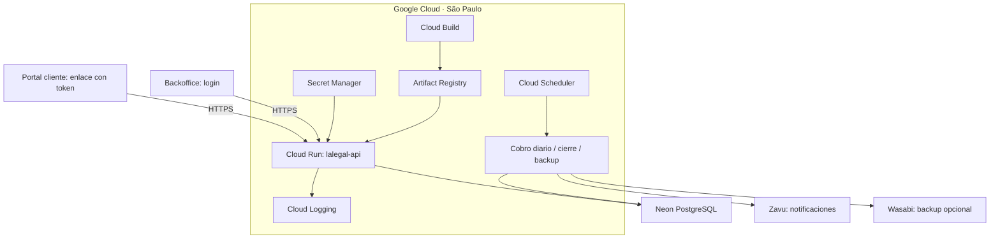

# Diagramas dentro de notas Markdown

Investigación para hiloo: 3 de octubre de 2026. Recomendación: **Mermaid**. Su integración queda pendiente; esta entrega incorpora el sidebar y Cerebro, no un renderizador de bloques Mermaid.

## Comparación

| Herramienta | Integración | Evaluación para hiloo |
| --- | --- | --- |
| [Mermaid](https://mermaid.js.org/config/usage.html) | JavaScript local; su API produce SVG. [Licencia MIT](https://github.com/mermaid-js/mermaid/blob/develop/LICENSE). | Mejor ajuste al editor Electron/React y al almacenamiento Markdown. |
| [D2](https://github.com/d2lang/d2/blob/master/d2js/js/README.md) | `@d2lang/d2` permite usar WebAssembly y Web Workers en el navegador. | Alternativa para arquitectura de software; exige verificar recursos WASM y workers del paquete. No requiere obligatoriamente un ejecutable Go. |
| [PlantUML](https://plantuml.com/starting) | La distribución local tradicional utiliza Java/JAR; algunos diagramas necesitan Graphviz. | Más dependencias para distribuir en Windows. Hay que elegir la [distribución y licencia](https://plantuml.com/download). |

## Comportamiento propuesto

Guardar el código como bloque cercado con lenguaje `mermaid` y mostrar su SVG en la vista visual. El archivo `.md` conserva la fuente editable. No se necesita IA integrada ni enviar notas a un servidor.

Hiloo ya conserva el lenguaje y texto de los bloques de código. El punto de integración es un NodeView para `code_block` en `src/renderer/src/editor-node-views.ts`, sin sustituir el contenido persistente por una imagen.

La configuración propuesta es renderización explícita, dependencia local y `securityLevel: 'strict'`, con límites de tamaño y conexiones. El modo Mermaid `sandbox` usa iframe y no encaja directamente con la CSP actual (`frame-src 'none'`). Ver [API y seguridad](https://mermaid.js.org/config/usage.html).

Antes de integrar: verificar conservación al abrir/guardar/reabrir, alternancia de vistas, errores de sintaxis, deshacer, diagramas grandes, actualizaciones simultáneas e impresión. Esta última debe esperar a que termine la generación del SVG. La compatibilidad aún no se ha probado en ejecución.

## Ejemplo simplificado

El texto libre de una arquitectura debe expresarse primero como nodos y conexiones. [Flowchart y subgraph](https://mermaid.js.org/syntax/flowchart.html) permiten representar el ejemplo recibido; no hay conversión automática desde texto alineado. Los detalles de configuración pueden mantenerse como texto junto al diagrama.

Este ejemplo ilustra las conexiones generales; no valida la configuración operativa, horarios o garantías de seguridad de la infraestructura descrita. **Cerebro** es una función distinta: dibuja las relaciones existentes entre archivos del cuaderno.
