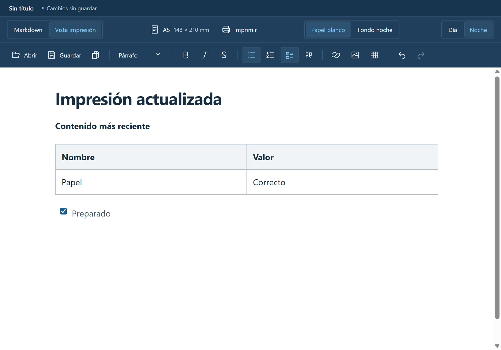

# Vistas y formato de impresión



## Markdown y Vista impresión

La barra permite alternar entre **Markdown**, para editar el código fuente, y **Vista impresión**, para trabajar con el documento formateado. Esta vista comienza con **Papel blanco** y texto oscuro, como en papel; **Fondo noche** permite leer y editar sobre azul oscuro. Ambas vistas representan el mismo documento. Cambiar de vista o de fondo sin editar no modifica el archivo ni lo marca como pendiente de guardar.

El selector **Día / Noche** cambia el tema de la interfaz, los controles de ventana, los diálogos y el editor Markdown. Noche conserva el azul original; Día usa fondo blanco. El fondo de Vista impresión se elige por separado: cambiar el tema del sistema no cambia esa elección. La impresión real siempre usa papel blanco, incluso al ver el documento con Fondo noche. El tema comienza en Noche y las preferencias se mantienen durante la sesión, sin modificar el archivo ni persistir al cerrar la aplicación.

La barra de formato de texto actúa sobre la vista visual. En Markdown se escribe la sintaxis directamente. Abrir, Guardar y Guardar como mantienen los atajos y las comprobaciones de cambios externos existentes.

El código debe pertenecer al [Markdown admitido](estilo-markdown.md) para convertirse a la vista visual e imprimirse. Si una conversión alteraría su estructura, se conserva el código y se muestra un aviso para corregirlo. No se ejecuta HTML escrito en el documento. La edición visual puede normalizar la sintaxis al modificar el contenido; alternar las vistas por sí solo conserva el original.

## Zoom

La barra inferior del documento controla el zoom, como en un procesador de textos: **Alejar** y **Acercar** en pasos de 10 %, un deslizador de 50 % a 200 % y el porcentaje actual, que restablece el 100 % al pulsarlo. **Ajustar a pantalla** amplía la hoja al ancho disponible y se reajusta al cambiar el tamaño de la ventana o abrir el panel lateral, hasta elegir otro zoom. Como la hoja ya se adapta a ventanas estrechas, el ajuste nunca baja del 100 %.

También funcionan **Ctrl++**, **Ctrl+-**, **Ctrl+0** y Ctrl+rueda del ratón sobre el documento. En la vista Markdown el zoom escala el tamaño del código. El zoom se mantiene durante la sesión, no modifica el archivo ni lo marca como editado y no afecta a la impresión ni a la vista previa.

## Formato de página

**Formato de página** abre un diálogo con tamaños predefinidos y un formato personalizado. Las medidas se muestran en milímetros:

| Formato | Ancho × alto |
| --- | --- |
| Carta | 215,9 × 279,4 mm |
| Oficio | 216 × 330 mm |
| Legal | 215,9 × 355,6 mm |
| A4, inicial | 210 × 297 mm |
| A5 | 148 × 210 mm |
| Personalizado | 50–1000 mm por dimensión, hasta un decimal |

Oficio y Legal tienen medidas distintas. Para otro papel denominado «oficio» por una impresora, usar Personalizado e introducir sus medidas. Un formato personalizado puede ser horizontal usando un ancho mayor que el alto.

Aplicar confirma el formato; Cancelar o Escape descarta los cambios del diálogo. El formato se mantiene durante la sesión de la ventana, no se incorpora al Markdown ni se conserva después de cerrar la aplicación. Elegir papel no marca el documento como editado.

## Imprimir

**Imprimir** o **Ctrl+P** prepara el contenido visual actual y abre **Vista previa de impresión** dentro de hiloo. Puede iniciarse desde cualquiera de las vistas, sin guardar el archivo primero. Se esperan la sincronización de ediciones, fuentes, imágenes y flujos Mermaid antes de generar el PDF temporal en memoria.

La vista previa muestra una página real del PDF, con **Anterior**, **Siguiente** y un contador. **Cancelar** o Escape cierra la vista sin imprimir. **Imprimir** dentro de la vista abre el diálogo del sistema. Mientras se revisa el PDF, el documento y el formato permanecen bloqueados; la confirmación comprueba que siguen correspondiendo a la revisión previsualizada. El PDF no se guarda ni exporta y tiene un límite de 20 MiB.

La salida usa el tamaño elegido y márgenes de 15 mm, texto oscuro sobre fondo blanco y reglas propias para tablas, imágenes y código. Excluye barras, botones, avisos y el editor de código. El contenido largo fluye entre páginas; la vista de edición no es una previsualización paginada.

La aplicación solicita las medidas al controlador de impresión; la impresora y su controlador deben admitir el papel seleccionado. Revisar en el diálogo nativo cualquier ajuste del controlador. Windows puede indicar que no admite vista previa en ese diálogo: la previsualización se realiza previamente dentro de hiloo. Cancelar la impresión conserva el contenido y permite continuar editando. La aplicación no guarda el documento como efecto de imprimir ni envía trabajos silenciosos.

La integración usa los puentes acotados `documents.printPreview` y `documents.print`, con validación de origen IPC, formato y revisión en el proceso principal. PDF.js dibuja el PDF en un lienzo con un worker local, sin marcos, enlaces activos ni scripts del documento. Las unidades de Electron se documentan en [webContents.print](https://www.electronjs.org/docs/latest/api/web-contents#contentsprintoptions-callback).

## CSS de impresión

**Configuraciones → CSS de impresión**, en el menú superior del panel lateral, abre un editor para personalizar el formato impreso de títulos, párrafos, citas, tablas, código y texto. **Usar ejemplo** inserta una plantilla. Guardar lo conserva en `print-style.css` del perfil de usuario, para todos los documentos y sesiones; dejarlo vacío vuelve al formato predeterminado.

Las reglas se aplican solo al imprimir y en la vista previa de impresión, nunca a la edición ni al archivo Markdown. Quedan limitadas al documento: los selectores se escriben relativos a él (`h1`, `p`, `blockquote`, `table`, `code`…) y las declaraciones sin selector afectan a todo el documento. Por ejemplo:

```css
font-family: Georgia, serif;
font-size: 12pt;
h1 { font-size: 22pt; text-align: center; }
p { text-align: justify; }
```

Estas reglas prevalecen sobre las predeterminadas de impresión. El tamaño de papel y los márgenes de 15 mm siguen definiéndose en **Formato de página**; `@page` no se admite. El CSS tiene un límite de 64 KB y se analiza en el proceso principal mediante el puente `settings`. Se admiten declaraciones, selectores relativos al documento y bloques `@media`, `@supports` y `@container`. Se rechazan CSS mal formado, selectores con `&`, selectores que comienzan con combinadores de hermanos y otras reglas globales, como `@import`, `@font-face` o `@keyframes`. La política de contenido también bloquea fuentes remotas.
